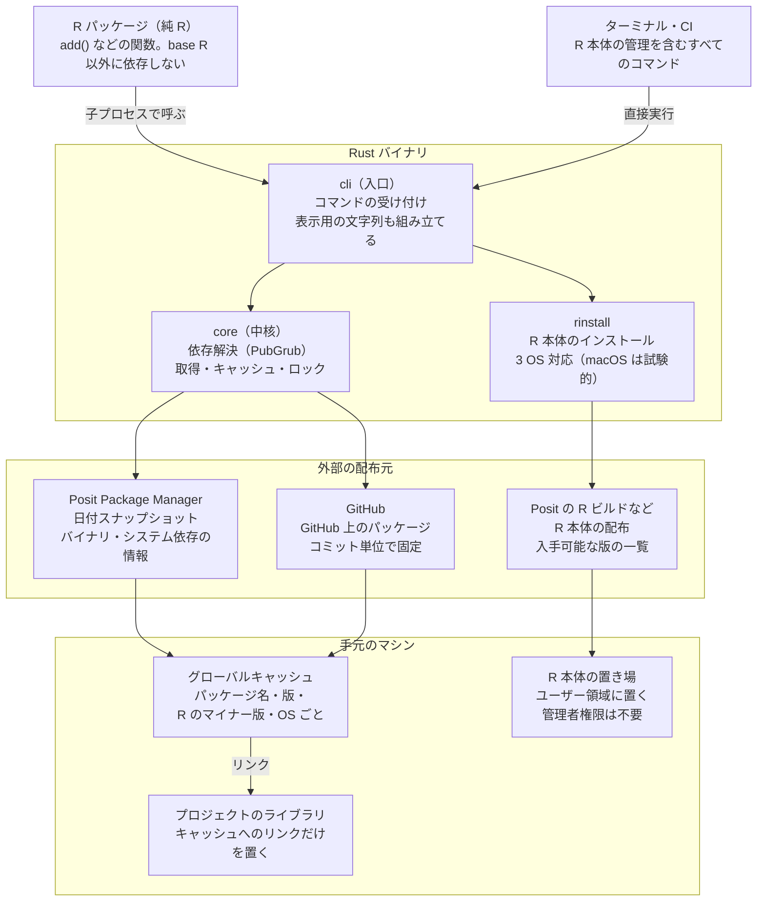
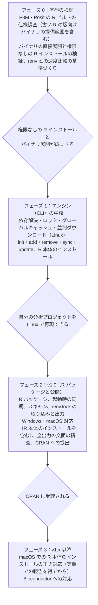

# rok 要件定義書（たたき台）

作成：2026-10-04

## 1. 目的と背景

rok は、R の分析プロジェクトの環境を「速く」「少ない手数で」「確実に」再現するためのパッケージマネージャである。Python における uv の体験を、R ユーザーが R の中で得られるようにする。

### 既存ツールの課題

- **インストールが遅い。** renv や install.packages() はパッケージを逐次処理する。Linux では素の CRAN がソースからのビルドになり、特に時間がかかる。
- **手数が多い。** renv では init()、install()、snapshot()、restore()、status() を、ユーザーが状態を意識して使い分ける必要がある。snapshot() の実行忘れで、ロックとライブラリがずれる。

### 既存の代替ツールとの違い

Rust 製の rv や uvr が登場しているが、いずれもターミナルで使う CLI が前提である。rok は次の3点で差別化する。

1. R の中で完結する体験（関数と IDE 連携が主役）
2. renv.lock との読み書き互換（既存プロジェクトからの移行を容易にする）
3. 手数の少なさ（宣言・ロック・ライブラリをツールが常に揃える）

### 基本理念

目標は、バグ修正済みの最新環境でコードを回すことではない。**プロジェクトを当時の状態で適切に再現すること**である。版の選択に迷う場面では、この理念を判断基準とする。

## 2. 対象ユーザーと利用シーン

主な対象は、R で日常的にデータ分析を行う実務の分析者である。管理対象は、分析プロジェクトの環境固定とする。

| 利用シーン | 求められること |
| --- | --- |
| 新しい分析プロジェクトを始める | 一手で環境を作り、すぐ作業に入れる |
| パッケージを追加・更新する | インストールと記録が一度に終わる |
| 共同研究者のプロジェクトを開く | 開くだけで同じ環境になる |
| 過去の案件を当時の環境で再現する | 当時の R とパッケージの版を復元できる |
| 納品先・共同研究者の R に合わせる | 指定された R の版で動かせる |
| Quarto で報告書をレンダリングする | 非対話の実行でも環境のずれを検知できる |

優先する OS は、Linux（WSL を含む）、Windows、macOS の順とする。

## 3. スコープ

v1 は、CRAN（P3M 経由、組織内の P3M を含む）、CRAN 形式のリポジトリ（R-multiverse、r-universe など）、GitHub のパッケージを使う分析プロジェクトを対象とする。R 本体のインストールは、3つの OS すべてを v1 に含める（macOS は試験的）。

| 区分 | v1 でやること | v1 でやらないこと |
| --- | --- | --- |
| 管理対象 | 分析プロジェクトの環境固定 | パッケージ開発の依存管理（DESCRIPTION） |
| 取得元 | CRAN（P3M のスナップショット、組織内の P3M を含む）、CRAN 形式のリポジトリ（R-multiverse、r-universe など）、GitHub | Bioconductor（v1.x。それまでは管理外として扱う） |
| R 本体 | 判定、既存の R での実行、Linux・Windows・macOS でのインストール（macOS は試験的） | macOS でのインストールの正式対応（実機での報告を得てから） |
| 版の別名 | latest | oldrel、devel |
| システム依存 | Linux での記録と apt コマンドの案内 | sudo の自動実行 |
| Suggests | 既知の組み合わせの提案（独自の規則も可） | Suggests の自動インストール |
| IDE の設定 | 開いているワークスペースの設定への追加（確認のうえ） | ユーザー全体の設定の変更 |

## 4. 全体構成

Rust 製の単体バイナリ（CLI）をエンジンとし、R パッケージはそれを呼ぶ薄い窓口とする。R の中から使っても、ターミナルから使っても、同じエンジンが動く。



R パッケージは子プロセスとしてバイナリを呼び、結果を受け取って表示する。表示用の文字列はバイナリが組み立てるため、R と CLI で表示が揃う。取得したパッケージはグローバルキャッシュに置き、プロジェクトのライブラリにはリンクだけを張る。

### リポジトリ構成

エンジンと R パッケージは、1つのリポジトリで管理する。

```
repo/
├── Cargo.toml          # Rust のワークスペース定義
├── crates/
│   ├── core/           # 依存解決、ダウンロード、キャッシュ、ロック、R の検出
│   ├── rinstall/       # R 本体のインストール
│   └── cli/            # コマンドラインの入口（バイナリ）
└── rpkg/               # R パッケージ（純 R、バイナリを呼ぶ）
```

- R パッケージは Rust をコンパイルしないため、CRAN へは `rpkg/` から作った tar.gz で通常通り提出できる
- R パッケージは起動時に、対応するバイナリの版かを確認する
- バイナリは GitHub のリリースで配布する。R からは初回の `init()` が、ユーザーの確認を1回得たうえで自動的に取得する

### R パッケージの置き場所と依存

R パッケージは各プロジェクトのライブラリに入れず、専用の置き場（`tools::R_user_dir("rok", "data")` 配下、R のマイナー版ごと）に置く。uv が `.venv` の外にいるのと同じく、ツールとプロジェクトの依存を分けるためである。

プロジェクトを有効にすると、`.libPaths()` は次の順になる。ユーザー全体のライブラリは参照しない。

1. プロジェクトのライブラリ（ロックに記録されたパッケージ）
2. 専用の置き場（rok の R パッケージのみ）
3. R 本体に付属するライブラリ

R パッケージは base R 以外に依存しない。依存があると専用の置き場に入り、プロジェクトのコードから宣言なしに使えてしまうためである。また、起動フック（`activate.R`）は、rok が未導入の環境でも base R だけで動く必要がある。

## 5. 機能要件

コマンド体系は uv に揃え、R の関数と CLI のサブコマンドを1対1で対応させる。

| R の関数 | CLI | 役割 |
| --- | --- | --- |
| `init(r = )` | `rok init --r` | プロジェクトを作成し、宣言・ロック・起動フックを用意する |
| `add(pkgs)` | `rok add` | 宣言に追加し、解決・ロック・インストールを一度に行う |
| `remove(pkgs)` | `rok remove` | 宣言から削除し、ロックとライブラリを揃える |
| `sync()` | `rok sync` | ライブラリをロック通りにする。宣言が変わっていればロックも更新する |
| `update(pkgs)` | `rok update` | スナップショットの日付を進め、依存を解き直す |
| `run(file, r = )` | `rok run` | 指定した R の版で、別プロセスとしてスクリプトを実行する |
| `status()` | `rok status` | 宣言・ロック・ライブラリ・R の版のずれを表示する |
| `pin_r(version)` | `rok r pin` | プロジェクトが使う R の版を変更する |
| `install_r(version)` | `rok r install [版]` | R 本体をインストールする |
| なし | `rok r list` | インストール済みと入手可能な R の版を一覧する |
| なし | `rok r uninstall` | R 本体を削除する |
| `export_renv()` | `rok export renv` | ロックから renv.lock を出力する |
| `import_renv()` | `rok import renv` | renv のプロジェクトから移行する |
| `undo()` | `rok undo` | 直前の add・remove・update・pin_r を1回分取り消す |
| `why(pkg)` | `rok why` | そのパッケージがなぜ入っているかを示す |
| `tree(pkg)` | `rok tree` | 依存関係を木の形で示す |
| なし | `rok self update` | rok 自身（バイナリと R パッケージ）を更新する |
| `setup()` | なし | 環境の修復やオフラインでの導入に使う。通常は init() が自動で行う |

R の関数は `rok::add()` のように名前空間を明示して呼ぶ使い方を基本とする。R パッケージの `update()`・`remove()` は、読み込むと `stats::update()`・`base::remove()` を隠す。それらに宛てた呼び出し（`update(モデル, ...)`、`remove(オブジェクト)` など）は、隠した関数へそのまま渡す。

### 主な挙動

- **init**：2通りの入り方を用意する。開いているフォルダ（Positron のワークスペースや RStudio のプロジェクト）で `init()` を実行するか、`init("~/projects/my-analysis")` のようにフォルダごと作る。ホームディレクトリや既存プロジェクトの中では、止めて確認する。
- **init の既定値**：R の版を省略した場合、R 上では今動いている R のマイナー版、CLI ではインストール済みの最新版を使う。R が1つもなければ最新のリリース版を入れる（事前に表示する）。スナップショットの日付には P3M が公開済みの最新の日付を記録し（第7章「スナップショットの日付」）、ロックには R のパッチ版まで記録する。
- **初回のセットアップ**：初めての `init()` では、ユーザーの確認を1回得たうえでエンジン（バイナリ）を取得し、R パッケージを専用の置き場に置く。`setup()` を別途実行する必要はない。
- **init 後の再起動**：IDE に再起動を指示し、プロジェクトを有効にしたコンソールを自動で用意する。グローバル環境にオブジェクトがある場合のみ、事前に確認する。IDE の外では、何も読み込んでいなければ確認のうえその場で切り替え、読み込み済みがあれば再起動を案内する。
- **共同研究者のプロジェクトを開く**：rok が未導入でも、`activate.R` が導入を提案し、確認1回で導入から同期まで行う。
- **renv.lock の取り込み**：renv.lock があるプロジェクトで init すると、移行を提案する（第7章「renv からの移行」）。

### 日常操作の原則

add・remove・update・pin_r は、次の4原則に従う。

1. **全部成功するか、何も変えないか。** 失敗した場合、宣言もロックも元のまま残す。
2. **変更は最小限にする。** ロックにある既存の版は、できるだけ動かさない。
3. **何が変わるかを必ず見せる。** 追加・更新・削除・据え置きを記号つきで一覧表示する。
4. **読み込み済みのパッケージに触れたら再起動を促す。**

### add

pak と同じ書き方を受け付ける。

```r
add("fixest", "sf")                # CRAN から
add("yo5uke/coresynth")            # GitHub から
add("yo5uke/coresynth@v0.3.0")     # GitHub のタグやコミットを指定
add("fixest", version = "< 0.13")  # 範囲を指定
add("did", latest = TRUE)          # この1件だけ今日の日付から
```

宣言には指定したパッケージだけを書き、依存はロックにだけ記録する。スナップショットの日付に存在しないパッケージは、`update()` か `latest = TRUE` を案内する。

### remove

宣言から削除し、そのパッケージだけが使っていた依存もライブラリから外す（キャッシュには残す）。コードでまだ使われている場合は、使用箇所を示して確認する。確認の既定は「削除しない」とする。宣言していないパッケージを指定した場合は、依存元を示してエラーにする。

### update

`update()` は、プロジェクトの時計（スナップショットの日付）を進めて、依存を解き直す操作である。版を意図的に上げるのは `update()` だけであり、普段の作業で版が勝手に変わることはない。

| 操作 | 何をするか | 時計 |
| --- | --- | --- |
| `sync()` | ライブラリをロックの通りに揃える | 動かない |
| `add()` | 新しいパッケージを加える | 動かない |
| `update()` | 時計を進め、全体を解き直す | 進める |

- **引数なし**：時計を、P3M が公開済みの最新の日付に進める。`to = "2027-01-31"` で任意の日付も指定でき、実在するスナップショットの日付に解決して表示・記録する（第7章「スナップショットの日付」）。過去の日付に戻す場合は、ダウングレードを目立たせて確認する。
- **確認**：変更一覧を見せてから確認を求める。メジャー版の更新と、範囲指定による据え置きを明示する。
- **パッケージ指定**：`update("sf")` は時計を進めず、そのパッケージと最小限の依存だけを新しい日付から取得する。日付の混在はロックに記録し、表示する。
- **変わらないもの**：R の版（`pin_r()` の役割）、宣言したパッケージの一覧、範囲指定。
- **GitHub のパッケージ**：全体の更新では据え置き、新しいコミットがあることを知らせる。GitHub のトークン（GITHUB_PAT など、pak と同じ環境変数）があれば、API でコミットの数も示す。更新は `update("user/repo")` で明示する。宣言で `track = true` としたものは、全体の更新に含める。
- **CRAN への切り替え**：GitHub から入れたパッケージの新しい版が CRAN に出たら、CRAN への切り替えを案内する。

### undo

直前の add・remove・update・pin_r を、1回分だけ取り消す。操作の直前の宣言とロックを1世代だけ保存しておく。R の版ごとにライブラリを分けているため、`pin_r()` の取り消しもすぐに反映できる。

### status

status は「何かおかしい」ときに最初に打つコマンドとして設計する。次の3原則に従う。

1. **速く、ネットワークを使わない。** 手元の宣言・ロック・ライブラリだけを見る。
2. **問題を重い順に並べ、それぞれに次の一手を添える。**
3. **既定は要約と問題だけを示す。** パッケージの全一覧は `status(packages = TRUE)` で表示する。

| 順位 | 問題 | 記号 |
| --- | --- | --- |
| 1 | R のマイナー版の不一致、R 本体の共有ライブラリの不足（Linux） | ✖ |
| 2 | 宣言とロックの食い違い（rok.toml の手編集など） | ! |
| 3 | ロックとライブラリの食い違い | ! |
| 4 | Linux のシステム依存ライブラリの不足 | ! |
| 5 | スキャンによる提案（宣言漏れ・使っていない宣言） | ℹ |
| 6 | 情報（パッチ版の違い、日付の混在、管理外のパッケージ） | ℹ |

宣言ファイルは手で編集してもよい。編集後は `sync()` で、ロックとライブラリが宣言に合わせて更新される。全一覧では、各パッケージの版・取得元・取得した日付・宣言の有無と範囲指定を示す。R から呼んだ場合は、表示に加えて状態を表すデータを不可視で返し、スクリプトやテストで判定に使えるようにする。

### why と tree

- `why("data.table")`：そのパッケージを必要としているパッケージと、コードで直接使っている箇所を示す（下から上へ）
- `tree()`：依存関係を木の形で示す。`tree("fixest")` で一部だけを表示する（上から下へ）

### 更新の下見

`update(dry_run = TRUE)` は、更新した場合の変更一覧を示し、何も変更しない。ネットワークを使うため、status ではなく update 側の機能とする。

### CI 向けのチェック

- `rok sync --locked`：宣言とロックが食い違っていれば、ロックを書き換えずに失敗する（uv の `--locked` にならう）
- `rok status --check`：何らかの問題があれば、終了コード 1 を返す

## 6. R バージョン管理

R の版は、宣言ではマイナー版まで、ロックではパッチ版まで記録する。バイナリの互換性はマイナー版単位なので、マイナー版の不一致は停止し、パッチ版の不一致は表示のみとする。

### 段階ごとの担当

| 段階 | 内容 | R パッケージ | CLI |
| --- | --- | --- | --- |
| L1 判定 | ロックの R の版と照合し、警告・停止する | 対応 | 対応 |
| L2 既存の R を使う | インストール済みの R を検出し、その R で同期・実行する | 対応 | 対応 |
| L3 R を入れる | R 本体をダウンロードしてインストールする | 対応（バイナリを呼んで実行） | 対応（3 OS、macOS は試験的） |

実行中の R セッションの版は、R の中から切り替えられない。ただし、別の版の R をインストールすることはできる。そのため R パッケージからも、バイナリを呼んで R 本体をインストールできる（`install_r()`、または `pin_r()` の中での提案）。今のセッションの切り替えだけは、IDE 側で行う。

### 不一致時の挙動

| 状況 | 挙動 |
| --- | --- |
| マイナー版が異なる | 同期を中止し、空の隔離ライブラリを有効にする。IDE の R の切り替え、`r install`、`pin_r()` を案内する |
| パッチ版のみ異なる | そのまま使い、ロックの記録と異なることを1行表示する |

### インストールする版の決め方

| 状況 | インストールする版 |
| --- | --- |
| ロックにパッチ版の記録がある | 記録された版（例：4.4.2） |
| ロックがない新規プロジェクト | 宣言されたマイナー版の最新パッチ。それをロックに記録する |
| 宣言でパッチ版まで指定している | 指定された版 |
| プロジェクトの外で版を指定 | `4.5` なら 4.5 系の最新、`4.5.1` なら厳密に、`latest` なら最新リリース |

すでに別のパッチ版（例：4.4.3）が入っている場合は、それで動かすことを許可する。インストール前には、要求・記録・インストールする版とその理由を必ず表示する。

`latest` は入力時のみ使える別名とし、宣言ファイルには解決後のマイナー版を書く。

### 置き場所

R 本体は、管理者権限なしで入れられ、IDE が認識しやすい場所に置く。パッケージはプロジェクト内のライブラリに置く。

| OS | R の置き場所 | IDE（Positron）からの認識 |
| --- | --- | --- |
| Linux | ユーザー領域（`~/.local/share/R/rok/r/<版>`） | ワークスペースの設定で探索場所を追加する（下記） |
| Linux（`--system`） | `/opt/R/<版>` | 自動で認識される。管理者権限が必要で、rok は sudo を実行せずコマンドを示す |
| Windows | ユーザー領域（`%LOCALAPPDATA%/Programs/R/R-<版>`） | 自動で認識される（Positron の標準の探索場所。V5） |
| macOS（試験的） | ユーザー領域（rok の置き場所の `r/R-<版>`） | 自動では認識されない。ワークスペースの設定で補う（下記） |

Linux では、Posit の portable なビルド（主な共有ライブラリを同梱し、展開した場所で動く。glibc 2.34 以上）を第一に使う。使えない場合（glibc が古い、提供が止まったなど）は、ディストリビューション向けのビルドを展開し、埋め込まれたパスを書き換えて使う。

Windows でも、Posit の portable なビルド（R 3.6.3 と 4.1.0 以降）を展開して使う。インストーラーは使わず、レジストリにも登録しない（ユーザー全体の設定を書き換えないため。V5）。portable なビルドのない版（4.0.x、3.6.2 以前）は自動では入れず、CRAN のインストーラーの入手先と手順を示す。利用者が入れた R は、rok が検出して使う（rok 自身はレジストリに書き込まない）。

macOS でも、Posit の portable なビルド（R 4.1.0 以降）を展開して使う（V6）。管理者権限は要らず、R.framework にも触れない。それより古い版は、Windows と同じく手動での導入を案内する。

R 本体の配置（ユーザー領域への展開）に管理者権限は要らない。ただし、R の実行に必要なシステムの共有ライブラリ（R の版ごとに異なる）が不足していると、R は起動しない。rok は配置の後に不足を判定し、不足していれば apt のコマンドを示す（sudo は実行しない）。不足したまま配置した場合は、status が ✖ で知らせる。判定の方法と範囲は、第7章「システム依存ライブラリ（Linux）」と同じである。

### IDE の設定（ワークスペース単位）

Positron に R を認識させる設定は、**今開いているプロジェクトの `.vscode/settings.json` にだけ書く**。ユーザー全体の設定には決して書き込まない。次の5原則に従う。

1. ユーザー全体の設定には書き込まない
2. 書き込む前に、必ず内容を見せて確認を得る
3. コメントや書式を保ったまま、rok が扱う項目だけを追加・変更する
4. 個人の環境に依存するパスを Git に載せない
5. rok が追加した項目は記録し、取り消せるようにする

原則4のため、設定には `~` で始まるパスで、rok が入れた R（ロックに記録したパッチ版）を書く。Positron は `~` をホームに展開するが、相対パスと `${workspaceFolder}` は無視する（V7）。rok の置き場所は利用者ごとに同じ相対位置にあるので、設定ファイルの中身は全員で同じになる。その R がない環境では、Positron は設定を無視するだけである。

| OS | 書く設定 |
| --- | --- |
| Linux | `positron.r.customRootFolders` に rok の置き場所（`~/.local/share/R/rok/r`）、`positron.r.interpreters.default` にプロジェクトの R |
| Windows | `positron.r.interpreters.default` にプロジェクトの R（`~/AppData/Local/Programs/R/R-<版>/bin/x64/R.exe`。探索場所は Positron の既定に含まれる） |
| macOS | `positron.r.customBinaries` と `positron.r.interpreters.default` にプロジェクトの R |

`interpreters.default` は、そのワークスペースで R をまだ選んでいないときの既定で、R が要るときに起動する（開いた直後には起動しない）。rok の置き場所を環境変数で変えている場合や、rok が入れていない R を使う場合は、自動では設定せず、手動での設定方法を案内する。

ワークスペースの信頼（危険な設定を信頼していないワークスペースで制限する IDE の仕組み）は回避せず、判断をユーザーと IDE に委ねる。

### R の版を変える（pin_r）

`pin_r()` は、プロジェクトが使う R のマイナー版を変える。パッケージのバイナリがすべて入れ替わるため、`update()` に近い大きな操作として扱う。

P3M のバイナリの有無は、パッケージの版・R のマイナー版・ディストリビューションの組ごとに異なる。R の公開前の日付にさかのぼってビルドされている場合もあるが、揃っているとは限らない。そのため `pin_r()` は、必要に応じて日付の変更とセットで行う。

1. 今の日付のまま、新しい R の版向けのバイナリが全パッケージに揃うかを確かめる（パッケージごとに P3M に問い合わせる）
2. 揃わない場合は、候補を示して選んでもらう
   - ロックの版を保ち、バイナリのないパッケージだけを、バイナリのある最も近い版に動かす（依存も最小限だけ動かす）。動かしたパッケージの日付はロックに記録する（日付の混在）
   - 今の日付のまま、バイナリのないパッケージをソースからビルドする
   - 全パッケージのバイナリが揃う、今の日付に最も近い日
   - 今日
3. 新しい R の版で全体を解き直し、差分を見せて確認する
4. 宣言とロックを更新する（直前の状態は `undo()` 用に保存）
5. その R が入っていなければ、インストールを提案する
6. 今のセッションは古い R のままなので、IDE での切り替えを案内する

古い版に戻す場合（共同研究者に合わせる場合など）も、同じ手順で候補を示す。古い R 向けのバイナリは、パッケージによって途中で提供が終わっている。

候補を探すときの P3M への問い合わせは、次の方針で行う。

- バイナリの有無は、HEAD を送って応答ヘッダーの `x-package-type` で判定する（ダウンロードしない）。同じ版なら、日付を変えてもバイナリの有無は変わらない（V4）。そのため結果は、パッケージ・版・R のマイナー版・ディストリビューション・arch をキーにして永久にキャッシュする
- 今の日付のままの確認は、パッケージの数 N だけの HEAD で済む。100件を16並列で送ると、約5秒である（1回あたり約 0.8 秒の遅延を見込む）
- 日付の探索では、候補の日付ごとの版を、パッケージごとの公開日時から求める（V10。N 回の問い合わせ）。HEAD は、まだ確かめていない版にだけ送る。そのため HEAD の回数は「パッケージ数 × 日付の数」ではなく、探索の範囲に現れる版の数になる。100件・前後24か月なら、数百回と見込む
- 探索は、月単位で粗く行い（前後24か月まで）、境目を日単位で詰める。最後に、選んだ日付で解き直し、全パッケージを HEAD で確かめる
- 上限：1回の操作で、HEAD は2,000回まで、同時接続は16本までとする。上限に達したら探索を打ち切り、それまでに見つかった候補を示す

## 7. 依存の決め方とファイル形式

依存の正本は宣言ファイル（`rok.toml`）とし、版は日付のスナップショットで決める。ロック（`rok.lock`）は独自形式とし、renv.lock は必要なときに出力する。

### 宣言ファイル

TOML 形式とし、ツールの設定も同じファイルに書く。

```toml
[project]
name = "my-project"
r = "4.4"
snapshot = "2026-10-04"

[dependencies]
fixest = "< 0.13"
sf = "*"
coresynth = { github = "yo5uke/coresynth" }

[sync]
on_startup = "auto"     # "auto" | "ask" | "notify"
noninteractive = "warn"  # "warn" | "error" | "auto"
```

### 取得元・GitHub・ビルド時の環境変数

```toml
[repositories]
multiverse = "https://community.r-multiverse.org"

[dependencies]
# CRAN 形式のリポジトリ（取得元をパッケージごとに明示する）
tidypolars = { repo = "multiverse" }
polars = { repo = "multiverse", env = { NOT_CRAN = "true" } }

# GitHub：既定のブランチを追う（ロックには取得時のコミットを記録）
coresynth = { github = "yo5uke/coresynth" }
# 既定のブランチを追い、全体の update() でも最新コミットまで上げる
fixes = { github = "yo5uke/fixes", track = true }
# 特定のブランチ、タグ、コミット
pkgA = { github = "user/pkgA", branch = "dev" }
pkgB = { github = "user/pkgB", tag = "v0.3.0" }
pkgC = { github = "user/pkgC", rev = "a3f9c21" }

# 取得元や環境変数と、範囲指定を組み合わせる（表の version）
tidypolars = { repo = "multiverse", version = ">= 0.10" }
arrow = { version = "< 20.0", env = { LIBARROW_BINARY = "true" } }
```

- **取得元の明示**：CRAN 以外のリポジトリから取るパッケージは `repo` で取得元を固定する。同名のパッケージを意図しない取得元から取る事故を防ぐためである。
- **CRAN 形式のリポジトリの再現性**：日付つきのスナップショットがない場合は、ロックの版で再現する。リポジトリに過去の版が残らない場合に備え、取得済みのファイルはグローバルキャッシュに残し、取得できないときは明確に知らせる。
- **過去の版が残らないリポジトリ**：r-universe 系のリポジトリ（R-multiverse の Community を含む）から取ったパッケージは、DESCRIPTION の `RemoteUrl` と `RemoteSha`（コミット）もロックに記録する。DESCRIPTION にどちらかがない場合は対象外とする。リポジトリにもキャッシュにもない場合、またはダウンロードしたファイルのハッシュがロックと一致しない場合（リポジトリ側で内容が変わったと見なす）は、`RemoteUrl` の git リポジトリ（GitHub など）から同じコミットを取得して作り直す。
  - ソースからのビルドになるため、重い同期として確認を求める
  - 作り直したものは、リポジトリが配っていた tar.gz と同一とは限らない。ロックに「git から再構築」と記録し、実行時に表示する。同一性はコミット（RemoteSha）で定め、ハッシュは別に記録しない（GitHub が生成する tar.gz はバイト単位で同一とは限らず、照合に使えないため）。ロックのハッシュの欄には、リポジトリが配っていた tar.gz のものを残す
  - 取得元の git リポジトリは、当面 GitHub だけに対応する。それ以外は失敗として明確に知らせる
  - コミットが取得できない場合（強制プッシュ、削除など）は、失敗として明確に知らせる
- **GitHub の指定**：uv にならい `branch`・`tag`・`rev` を使う。`track = true` は、ブランチを追う指定とだけ組み合わせられる。`add("user/pkg@ref")` の `@` 以降は、rok がタグ・ブランチ・コミットのどれかを判定して書き分ける。
- **表の形での範囲指定**：`repo` や `env` と範囲指定を組み合わせるときは、表の `version` に書く。範囲指定だけのときは、これまでどおり文字列で書く（`fixest = "< 0.13"`）。
- **ビルド時の環境変数**：ソースからビルドするときに効く環境変数を `env` で指定する。ビルド結果に影響するため、ロックにも記録する。polars の `NOT_CRAN = "true"` のような既知のものは、スキャナーの規則として提案する。

### 版の決め方

| 指定方法 | 位置づけ |
| --- | --- |
| 日付のスナップショット | 版を決める基本の手段。作成時に公開済みの最新の日付を記録し、`update()` で明示的に進める |
| 範囲指定（`>=`、`<` など） | ガードレール、または一部パッケージの据え置き |
| 厳密な版の指定（`"0.12.1"`） | 範囲指定の特別な場合 |

範囲指定の版は、R の規則で比べる（`1.0` < `1.0.0`、`1.0-1` = `1.0.1`）。宣言では数1つの版も書け、`2` は `2.0` と同じに扱う（`fixest = "< 2"`）。R の版は数を2つ以上持つので、比べた結果は変わらない。

CRAN は基本的に最新版しか配布しないため、範囲指定で古い版が必要になった場合は次の順で探す。

1. 過去の日付の P3M スナップショットからバイナリを取得する
2. 見つからなければ、CRAN のアーカイブからソースを取得してビルドする（重い同期として確認を求める）

日付の異なるバイナリが混在した場合は、必ず表示し、ロックにも記録する。解決できない場合は、PubGrub 方式で解けない理由を依存の連鎖として説明する。

### スナップショットの日付

日付は、ローカルの今日ではなく、P3M が公開済みのスナップショットの日付に解決してから使う。P3M は最新より後の日付を受け付けず、その日の分が公開されるまでは今日の日付が使えないためである。

- 既定の日付（`init()`、引数なしの `update()`）は、P3M が公開済みの最新の日付とする
- ユーザーが指定した日付（`update(to = )` など）は、その日以前で最も新しい実在の日付に解決する。指定と異なる日付になった場合は、解決後の日付を表示する
- 宣言とロックには、解決後の日付を記録する
- 最初のスナップショット（2017-10-10）より前の日付と、今日より後の日付はエラーにする

### ソースからのビルド

CRAN のパッケージをソースからビルドする場合は、P3M ではなく CRAN（現行の版は `src/contrib`、過去の版は `src/contrib/Archive`）から tar.gz を取得する。P3M が配るソースは、DESCRIPTION に `Repository: RSPM` が加わっていて CRAN のファイルと一致せず、ロックのハッシュと照合できないためである。CRAN に接続できない環境（組織内の P3M だけが使える場合など）では P3M のソースを使い、ハッシュの照合は行わない。

### スキャンの役割

コードのスキャンは、宣言にないパッケージの追加や、使われていないパッケージの削除を**提案する**ために使う。install.packages() などで入れただけのパッケージは記録しない。起動時は前回から変更されたファイルだけを解析し、全ファイルの解析は `sync()` 時に行う。

### Suggests

Suggests は記録しない。必要なものは宣言に明示的に追加する。取りこぼしを減らすため、次の補助を行う。

- スキャナーに既知の組み合わせを持たせる（.qmd・.Rmd があれば knitr と rmarkdown、`geom_sf()` があれば sf など）
- 「パッケージが必要です」というエラーに、`add()` での追加方法を添える

### スキャナーの規則

「条件 → 提案」の規則をデータとしてバイナリに同梱し、rok 本体とは独立に改善できるようにする。条件は、ファイルの種類、関数の呼び出し、関数の呼び出しと引数の値の3種類とする。提案は自動では追加せず、`add()` での追加を案内するにとどめる。

| 条件 | 提案するパッケージ |
| --- | --- |
| .qmd または .Rmd がある | knitr、rmarkdown |
| .qmd・.Rmd に Python のチャンクがある | reticulate |
| `geom_hex()` | hexbin |
| `geom_sf()`、`coord_sf()` | sf |
| `coord_map()` | mapproj |
| `map_data()` | maps |
| `geom_quantile()` | quantreg |
| `ggsave()` で .svg に保存 | svglite |
| `modelsummary()` の `output` に gt・flextable・kableExtra・huxtable を指定 | 指定したパッケージ |

組織やプロジェクトに固有の規則は、v1 から宣言ファイルに書ける。

```toml
[[scan.rule]]
when = { call = "mytools::render_report" }
suggest = ["officer", "flextable"]
```

### システム依存ライブラリ（Linux）

Linux の P3M バイナリはシステムの GDAL などを参照するため、別途 apt でのインストールが必要になる。ロックにはディストリビューションごとの必要ライブラリ（P3M の情報）を記録する。不足は、バイナリの共有ライブラリが参照するライブラリを調べて判定し（ネットワークを使わない）、不足があれば、実行に必要なパッケージに絞った apt のコマンドを表示する。sudo は実行しない。

- 判定と絞り込みは、Debian・Ubuntu 系（apt）で検証した。それ以外のディストリビューションでの扱いは未決とする（第12章）
- 検出できるのは、共有ライブラリのリンク時の依存（ELF の NEEDED）だけである。実行時に動的に読み込むライブラリや、外部のコマンド（gdal-bin など）の不足は検出できない
- 実行に必要なパッケージへの絞り込みには、apt のパッケージの一覧が要る。一覧がない環境（作成時に一覧を消した docker のイメージなど）では、P3M の情報にある -dev パッケージを、`apt-get update` を添えて案内する。これは必要以上に多くのパッケージを入れる代替策であり、案内の文面にもその旨を明記する

### ロックファイル

uv.lock にならい TOML 形式とする。OS 共通の1ファイルとし、Linux・Windows・macOS で同じロックを共有できるようにする。

```toml
version = 1
generated-by = "rok 0.1.0"

[r]
version = "4.4.2"

[snapshot]
date = "2026-10-04"
repository = "https://packagemanager.posit.co/cran"

[manifest]
dependencies = ["coresynth", "fixest", "sf"]
constraints = { fixest = "< 0.13" }

[[package]]
name = "fixest"
version = "0.12.1"
source = { repository = "cran", snapshot = "2026-07-15" }
dependencies = ["data.table", "dreamerr", "Rcpp"]
sha256 = "…"
```

- `[manifest]` に宣言の写しを持ち、ロックが古いかを高速に判定する
- ハッシュは、CRAN が配布する OS 共通のソース tar.gz の SHA-256 とする。P3M の API から得られる場合（その時点で最新の版）と、ソースを取得した場合に記録し、それ以外は空欄とする。P3M の API は過去の版のハッシュを返さず、得るには tar.gz の取得が必要になるためである
- CRAN 以外の CRAN 形式のリポジトリ（R-multiverse、r-universe など）では、索引に載っているソースの SHA-256 を記録する。ダウンロード後にハッシュが一致しない場合の扱いは、「過去の版が残らないリポジトリ」による（実装メモ：R-multiverse の Production の索引は、SHA256 の値を DCF の継続行に書いている。索引のパーサーは継続行を扱う）
- 過去のスナップショットから取得したものは、その日付を記録する
- パッケージは名前順に並べ、Git の差分を読みやすくする

### renv.lock との互換

renv.lock の取り込みと出力に対応する。設定で、ロック更新のたびに renv.lock を自動生成することもできる。自動生成した renv.lock は派生ファイルとし、正本は常に `rok.lock` とする。取り込み時は、記録された R の版（例：4.4.1）をマイナー版の要求（4.4）として解釈する。

出力する renv.lock は、Hash を含まない最小限の形式とする。Hash は renv の内部仕様で、追従し続ける負担が大きいためである。代わりに、rok で作った環境を出力し、空の環境で `renv::restore()` して版が一致するかを確かめる往復テストを CI に組み込む。リポジトリには P3M の日付つき URL を書き、日付が混在するパッケージは日付ごとのリポジトリを参照させる。

### renv からの移行

移行の入り口は2つある。`init()` が renv.lock を検出して移行を提案するほか、専用の `import_renv()`（CLI では `rok import renv`）も用意する。移行後のロックは、**renv.lock と完全に同じ版**になることを保証する。

| renv.lock の項目 | rok での扱い |
| --- | --- |
| R の版（例：4.3.2） | 宣言は `r = "4.3"`、ロックは 4.3.2 |
| CRAN のパッケージと版 | ロックに同じ版で記録する |
| GitHub のパッケージ | 同じコミットに固定する |
| リポジトリの URL | 日付が入っていれば、スナップショットの日付に使う |
| renv 自身、Hash | 取り込まない |

**宣言の推定**：renv.lock には「直接使っているパッケージ」の区別がない。依存関係の根っこ（ロック内のどのパッケージからも依存されていないもの）と、コードのスキャンで直接使われているものの和集合を候補として示し、ユーザーの確認を得る。

**日付の推定**：リポジトリの URL に P3M の日付が入っていれば、それを使う。入っていなければ、ロックの版がすべて CRAN の最新版だった日を P3M の履歴から探す。全版が揃う日がない場合は、最も多く一致する日を選ぶ。残りの版はロックにのみ記録し、宣言の範囲指定にはしない（範囲指定にすると、update() で永遠に据え置かれるため）。

**扱えない取得元**：Bioconductor やローカルのファイルなど、v1 で扱えない取得元が含まれる場合は、移行を中止するか、それらを管理外として残すかをその場で選んでもらう。

**ファイルの扱い**：何も削除しない。`.Rprofile` の renv の起動行だけを置き換え、`renv/` と renv.lock は残して削除してよい旨を案内する。移行そのものも `undo()` で取り消せる。

**逆方向**：`export_renv()` で renv.lock を出力できる。学術誌への再現用パッケージの提出などで使う。

### 管理外のパッケージ

rok が版を管理しないパッケージは、宣言の `[unmanaged]` に記載する。

```toml
[unmanaged]
packages = ["DESeq2", "limma", "mypkg"]
```

- インストールも削除もしない（ユーザーが `BiocManager::install()` などで入れる）
- インストール済みの DESCRIPTION から依存関係を読み、CRAN の依存は依存解決に含める
- 版はロックに記録だけする
- 起動時の1行に、管理外のパッケージの数を添えて知らせ続ける

Bioconductor などに対応した後は、この区分から通常の管理に移せるようにする。

## 8. 起動時の同期とユーザー体験

セッション開始時に、プロジェクトの `.Rprofile` からずれを確認する。軽い同期は自動で行い、重い同期だけ確認を求める。宣言・ロック・ライブラリの3つは、ツールが常に揃え、ユーザーに揃えさせない。

### 判定基準

| 区分 | 条件 | 挙動 |
| --- | --- | --- |
| 変化なし | ロック・ライブラリ・R の版が一致 | 1行の表示のみ |
| 軽い | バイナリだけで済み、R のマイナー版が一致 | 自動で同期する |
| 重い | ソースからのビルドが必要 | 内容を示して確認を求める |
| 要対応 | R のマイナー版が不一致 | 同期せず、選択肢を示す |

重い同期では、確認を求める前に、ソースからのビルドに必要なコンパイラ・make・-dev パッケージの不足を判定する（ネットワークを使わない）。不足があれば、確認の中に apt のコマンドを示す。Windows では、R が参照する Rtools（`etc/Rcmd_environ` の `RTOOLS4x_HOME`）の有無を判定し、不足があれば Rtools の入手先を示す。判定が外れてビルドに失敗した場合は、ログから不足の手がかりを示す。

パッケージの削除とダウングレードは「軽い」に含める。プロジェクトのライブラリからリンクを外すだけで、キャッシュには残るためである。セッション開始時はパッケージが未読み込みのため、Windows の DLL ロックも起きない。

### 場面ごとの挙動

| 場面 | 挙動 |
| --- | --- |
| 変化なし | `rok: my-project (R 4.4.2, 132 packages) ✔` の1行のみ |
| 軽い同期 | 変更内容（追加・更新・削除）を表示しながら自動で同期する |
| 重い同期 | すべて同期・バイナリ分だけ同期・同期しない、の3択を示す |
| R のマイナー版が不一致 | 同期を中止し、空の隔離ライブラリを有効にして、対処法を示す |
| パッチ版のみ不一致 | 通常の1行に、ロックの記録と異なる旨を1行添える |
| 非対話のセッション | 既定では同期せず、エラー出力に警告を出す。厳格モードではエラーで停止する |
| ネットワーク不通 | キャッシュにある分だけ同期し、未同期のものを示す |
| 宣言にないパッケージをコードで検出 | 新たに見つかったときだけ、`add()` での追加を提案する |

「バイナリ分だけ同期」では、未同期のパッケージに依存しないものだけを対象とし、対象外になったものは理由とともに表示する。

### 表示例（R の版が不一致の場合）

```
! This project requires R 4.4, but the current R is 4.5.1.
ℹ Packages built for R 4.4 are not compatible with R 4.5, so sync was skipped.
ℹ To fix this, do one of the following:
  • Switch your IDE's R to 4.4.2 (installed at ~/.local/share/R/rok/r/4.4.2)
  • Run `rok r install` in a terminal to install R 4.4
  • Run `rok::pin_r("4.5")` to migrate this project to R 4.5
```

## 9. 非機能要件

最重要の非機能要件は速度であり、特に起動時チェックは毎回走るため、体感できない速さを求める。目標値は、測る場面（S1〜S4）と測るプロジェクトを固定したうえで置く。

### 速度

| 場面 | 中身 | 目標（Linux） |
| --- | --- | --- |
| S1 起動時チェック | 変化なしのとき、R の起動に上乗せされる時間 | 100 ミリ秒以内 |
| S2 依存の解決 | パッケージ一覧から版を決めるまで（索引はキャッシュ済み） | medium で 1 秒以内 |
| S3 キャッシュ済みの同期 | 全パッケージがキャッシュにある状態での同期 | medium で 2 秒以内 |
| S4 初回の構築 | キャッシュが空の状態からの構築 | 比較対象（renv・pak・rv・uvr）の中で最速クラス |

| 測るプロジェクト | 中身 | 狙い |
| --- | --- | --- |
| small | fixest＋modelsummary | 典型的な計量分析 |
| medium | tidyverse | パッケージ数の多さ |
| gis | sf＋terra＋tmap | システム依存ライブラリが絡む構成 |

測るプロジェクトは必要に応じて追加できる。S4 は通信環境に依存するため、同じ環境で他のツールと比べる相対評価とする。Windows も同じ目標値とする（V13 の実測で、S1〜S3 は Linux と同じ水準だった）。

速度は次の手段で実現する。

1. バイナリパッケージは R を起動せず、Rust 側で展開する
2. 依存ツリー全体を先に解決してから、並列にダウンロードする
3. グローバルキャッシュ（キーは パッケージ名・版・R のマイナー版・OS）を持ち、プロジェクトのライブラリにはリンクを張る
4. Linux でも P3M のバイナリを使い、ソースからのビルドを減らす
5. 日付つきスナップショットの索引は二度と変わらないため、一度取得したら永久にキャッシュし、2回目以降の解決ではネットワークを使わない

### 対応 OS

Linux（WSL を含む）を最優先とし、Windows、macOS の順に対応する。Linux の対応ディストリビューションは、P3M と Posit の R ビルドが対応する範囲に従う。

### 再現性

- ロックだけで、同じ版のパッケージと R を復元できること
- ロックは OS 共通で、Linux・Windows・macOS の間で共有できること
- 日付の混在やパッチ版の違いなど、再現性に関わる差異は必ず表示すること

### 安定性

- 同期の失敗で、R セッション自体が使えなくなってはならない
- 読み込み済みのパッケージを、同じセッションから上書きしない

### 完全性の検証

ダウンロードしたファイルは、2段構えで検証する。

1. **ダウンロード時**：HTTPS で取得し、索引にチェックサムが載っていれば照合する。照合に失敗したら展開せずにエラーにする。
   - Windows・macOS のバイナリは、索引の `Hash`（MD5）と照合する
   - **Linux のバイナリは、索引にチェックサムがないため、HTTPS のみによる検証となる**（P3M の Linux の索引はソースの索引と同一で、チェックサムの欄を持たない）
   - CRAN から取得したソースは、ロックに SHA-256 があれば照合する（第7章「ソースからのビルド」）
2. **ロック**：CRAN が配布する OS 共通のソースの tar.gz の SHA-256 を、得られる場合に記録する（第7章「ロックファイル」）。パッケージの同一性は「版・取得元・日付」で定め、バイナリはその実体として扱う。

索引のチェックサムの有無は、フェーズ0（V3）で確認した。OS ごとのバイナリのハッシュもロックに記録する厳格モードは、必要になった時点で追加する。

### メッセージ

- tidyverse のスタイルガイドに準拠する（1行目で問題を述べ、続く箇条で詳細と対処法を示す）
- 実装上のメッセージは英語とする
- 表示用の文字列（記号・色を含む）はバイナリが組み立て、R パッケージはそれを出力する。状態などの構造化データは JSON で返す
- ダウンロード（パッケージ・R 本体）は進捗を表示する。端末では全体のバーと、取得中のうち大きいものを複数行で示す。R の対話セッションでは、1行を書き換えて全体の件数とバイト数を示す。どちらも完了後はバーを消し、取得した件数・量・時間の1行を残す。端末でも R の対話セッションでもないとき（ログ・CI・Rscript）は、進捗を出さない

## 10. 制約と前提

rok は Posit の配布サービスに大きく依存する。サービスの仕様変更や停止は、最大のリスクとして扱う。

| 区分 | 内容 |
| --- | --- |
| パッケージの配布元 | Posit Package Manager（日付スナップショット、Linux バイナリ、システム依存の情報） |
| R 本体の配布元 | Posit の R ビルド（3 OS とも portable なビルドを使う。Linux ではこれを第一に使う。試験的な提供であることをリスクとして扱う）。入手可能な版の一覧もここから得る |
| GitHub | GitHub 上のパッケージの取得。API の利用回数制限に注意する |
| R-multiverse・r-universe | Linux 向けのバイナリは、最新の Ubuntu LTS の R の現行版・開発版向けに限られる。Ubuntu 24.04（noble）では、r-universe 系の多くのパッケージがソースからのビルドになり、コンパイラなどのビルドツールが前提になる（V12） |
| CRAN の規約 | R パッケージは Rust をコンパイルしない純 R とする。ホームディレクトリへの書き込み（バイナリの取得を含む）は、対話的なセッションでユーザーの確認を得てから行う。置き場所は `tools::R_user_dir()` に従う（reticulate と同じ方式） |
| 権限 | 既定の操作（R 本体とパッケージの配置を含む）は管理者権限を必要としない。Linux でシステムの共有ライブラリが不足している場合だけ、その導入に管理者権限が要る。rok は sudo を実行せず、apt のコマンドを示す |
| バージョンの整合 | R パッケージは起動時に、対応するバイナリの版かを確認する |
| 先行ツール | rv、uvr（いずれも MIT ライセンス）の実装を参考にできる |

## 11. マイルストーン

v1.0 の公開までを、検証・エンジンの中核・R パッケージの3段階に分ける。各フェーズの間に、次に進むためのゲートを置く。時期は未定である。



フェーズ 0 の検証で権限なしの R インストールが成立しない場合は、第6章の置き場所の方針を見直す。

全出力の文面（コンソール表示）は、機能が一通り揃った後に独立した工程として精査する。本書の表示例の文面は仮のものである。

## 12. 未決事項

たたき台の段階で未確定だった事項は、すべて決定して各章に反映したか、第13章の検証項目に移した。ツール名は rok に決定した。その後に生じた未決事項は、未チェックの項目として残す。

- [x] ツール名と、それに伴う宣言・ロックのファイル名（候補：ron、rk、rok）
- [x] 速度の目標値（第9章の提案値をベンチマークで確定する）
- [x] バイナリパッケージの検証方法（ハッシュの確かめ方）
- [x] Linux で管理者権限なしに R を入れる方法の実地検証（第13章 V1 へ）
- [x] Positron で R の追加の探索場所を指定する設定の名前と、ツールからの案内方法
- [x] renv.lock の出力で求める互換の程度（renv の Hash の計算方法を合わせるか）
- [x] init 時に既存の renv.lock を自動で取り込むか
- [x] スキャナーに持たせる「既知の組み合わせ」の初期リスト
- [x] Bioconductor と社内リポジトリへの対応時期
- [x] Windows・macOS での R 本体のインストールの対応時期
- [x] P3M が古い R の版向けにバイナリを提供する範囲（第13章 V4 へ）
- [x] GitHub パッケージの track 指定の書式と、新しいコミット数の取得方法
- [ ] Debian・Ubuntu 系以外（RHEL 系、openSUSE など）での、システム依存ライブラリの不足の判定と案内の方法（第7章。V3b は apt で検証した）

## 13. フェーズ0の検証計画

フェーズ0では、本格的に作り始める前に、設計の前提が成り立つかを16項目で確かめる。V1〜V3 はゲート0（権限なしの R インストールとバイナリ展開が成立する）の条件である。

| ID | 確かめること | 成功の条件と設計への影響 | 優先度 | 状態 |
| --- | --- | --- | --- | --- |
| V1 | Linux で権限なしに R を入れられるか | ユーザー領域に置いた R でパッケージの導入と読み込みができる。失敗したら `/opt/R` を基本とし、sudo のコマンドを示す方式にする | 最優先 | 完了 |
| V2 | バイナリパッケージを R を使わずに展開できるか（3 OS） | 展開しただけで `library()` が通る。失敗したら `R CMD INSTALL` を経由し、速度の目標を見直す | 最優先 | 完了 |
| V3 | P3M の仕様 | スナップショットの URL、OS・ディストリビューション・R の版ごとのバイナリの URL、索引のチェックサムの種類、システム依存の情報を機械的に取得できる | 最優先 | 完了 |
| V3b | Linux のシステム依存の実行時ライブラリの判定 | P3M の sysreqs API はビルド用の -dev パッケージを返すため、そのまま使うと不足を過剰に判定する。展開したバイナリの共有ライブラリ（`ldd` など）から、実行時に不足するライブラリと、それを含む apt のパッケージを特定できる。失敗したら -dev パッケージで判定し、過剰な案内になることを受け入れる | 高 | 完了 |
| V3c | Linux のビルドツールの不足の判定 | ソースからのビルドに必要なもの（gcc・g++・gfortran・make と sysreqs の -dev パッケージ）の不足を、root もネットワークも使わずに判定し、V3b と同じく apt のコマンドに絞り込める。失敗したら、ビルドの失敗のログから案内する | 高 | 完了 |
| V1b | portable な R ビルド | Posit の portable なビルド（Linux・Windows・macOS）で、apt なしの配置、ソースからのビルド、システムのライブラリを使うパッケージ、IDE の認識が成り立つ。成り立てば、第6章の R 本体の入れ方の第一候補にする | 高 | 完了（3 OS で配置が成り立つ。IDE の認識は、Windows は自動、Linux・macOS はワークスペースの設定で補う） |
| V4 | P3M が古い R の版向けにバイナリを提供する範囲 | `pin_r()` で古い版に戻すときの、日付の候補の出し方を決める | 高 | 完了 |
| V5 | Windows での R のインストール | 権限なし・画面なしで `%LOCALAPPDATA%/Programs/R` に入り、複数の版が共存し、Positron が認識する | 高 | 完了（portable なビルドで、権限なし・画面なし・レジストリなしの配置、複数の版の共存、Positron の自動の認識） |
| V6 | macOS での R のインストール | GitHub Actions で rig の方式を再現し、複数の版の共存と Positron での認識を確かめる。v1.0 で試験的に載せる範囲を決める | 高 | 完了（rig の方式ではなく portable なビルドで、権限なしの配置と共存が成り立つ。R 4.1.0 以降。Positron の認識はワークスペースの設定で補う〔実機では未確認〕） |
| V7 | Positron のワークスペース設定 | `customRootFolders`・`customBinaries`・`interpreters.default` がワークスペースで効くか、相対パスや変数が使えるか、ワークスペースの信頼との関係。第6章の3つの分岐のどれになるかを決める | 高 | 完了（効く。パスは絶対パスか `~` のみ。信頼していないフォルダでは R が起動しない） |
| V8 | IDE への再起動の指示 | RStudio と Positron に、base R だけで再起動を指示できる（rstudioapi は使えないため） | 高 | 完了（どちらも `.rs.api.restartSession()`。グローバル環境は残らない） |
| V9 | renv との往復テスト | Hash なしの renv.lock で `renv::restore()` が動き、パッケージごとのリポジトリ指定が尊重される | 中 | 完了 |
| V10 | renv からの移行での日付の推定 | 「ある版が CRAN の最新だった期間」を P3M の情報から効率よく求められる | 中 | 完了 |
| V11 | Windows のジャンクション | R の読み込み、OneDrive の同期フォルダ、ウイルス対策ソフトとの相性に問題がない | 中 | 完了（OneDrive の同期フォルダでは、ジャンクションに ReadOnly が付くため、外してから消す） |
| V12 | R-multiverse・r-universe の仕様 | Production のスナップショットの URL の形式、Linux 向けバイナリの提供範囲が分かる | 中 | 完了 |
| V13 | 速度のベンチマーク | small・medium・gis で renv・pak・rv・uvr の S1〜S4 を測り、S4 と Windows の目標の基準にする | 基準づくり | 実施中（Linux・Windows 分は rok を含めて完了。macOS は未） |

### 進め方

- 本体のリポジトリ `rok` の中に `spikes/` を作り、検証ごとに小さなスクリプトを置く。GitHub Actions で Linux・Windows・macOS の3環境で自動実行し、Mac が手元にない制約を補う
- 結果は1項目ずつ記録し、成功・失敗と設計への影響を本書に反映する
- V1〜V3 から始める。ゲート0の条件であり、ここが通らないとフェーズ1に進まない
